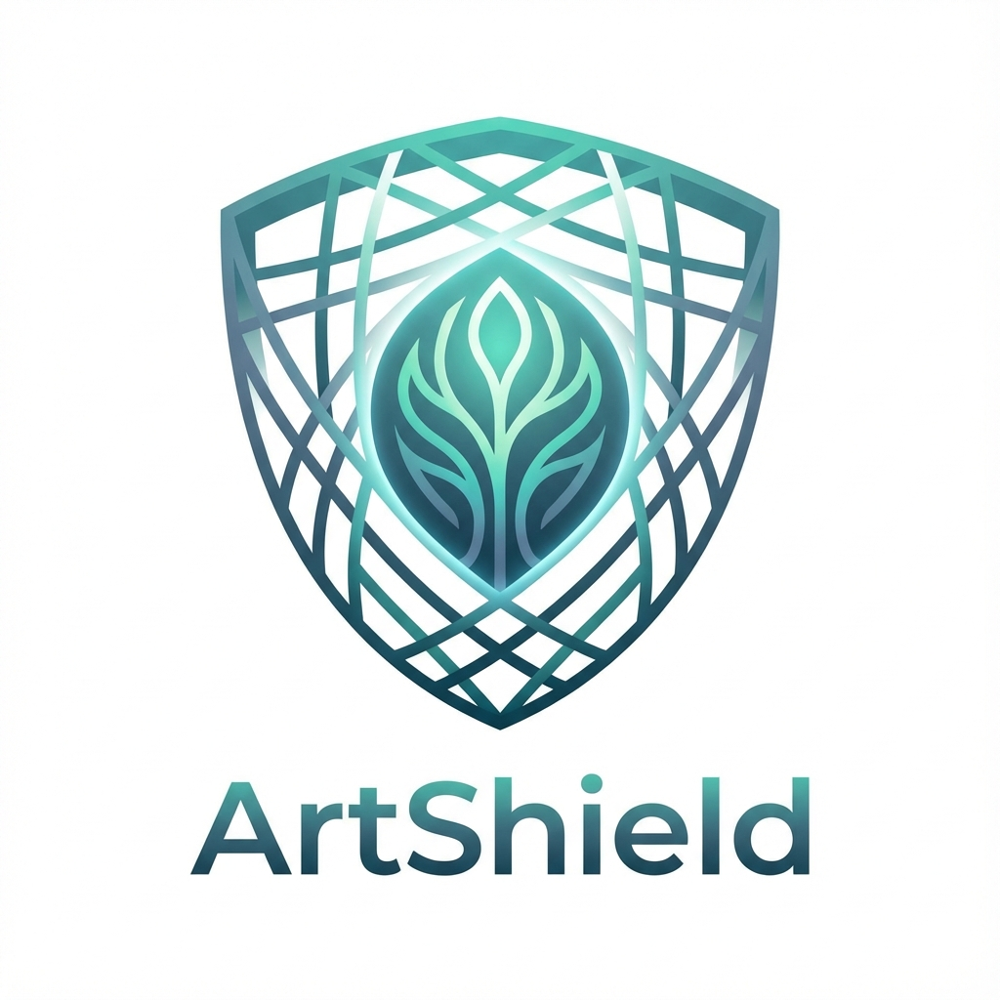

# ArtShield

<div align="center">
  
  <h1>Democratizing Defense in the Age of AI</h1>
  <p>
    <strong>A local-first, privacy-focused tool for independent artists to protect their work from non-consensual AI training.</strong>
  </p>
  <p>
    <a href="https://jwlehane.github.io/artshield/"><strong>View Web Demo</strong></a> • 
    <a href="#getting-started">Getting Started</a> • 
    <a href="#how-it-works">How It Works</a>
  </p>
</div>

---

## 🛡️ The Mission

**ArtShield** is the "Signal" of image protection. In a landscape where creative work is scraped without permission, we provide a "One-Click Shield" that restores agency to the artist.

We believe:
1.  **Consent is Non-Negotiable:** Artists should decide if their work updates a model.
2.  **Privacy is Paramount:** Your art never leaves your machine. Processing happens locally on your GPU/CPU.
3.  **Access is Equity:** Protection shouldn't require a Computer Science degree.

## ✨ Features

- **The Cloak (Mist v2):** Integrated adversarial protection that disrupts style mimicry in AI models.
- **The Tag (Metadata):** Injects "Do Not Train" signals (`NoAI` tags, Copyright assertions) directly into file headers.
- **The Stamp (Watermark):** Optional, elegant visual watermarking for social media display.
- **Local Execution:** Powered by a Python backend that runs entirely on your device (Windows/Mac).
- **Web Demo Mode:** A browser-based "Mock Mode" to demonstrate the UI/UX without installing the desktop app.

## 🏗️ Technical Architecture

ArtShield uses a **Hybrid Architecture** to combine raw Python power with a modern, responsive UI.

-   **Frontend:** [React](https://react.dev/) + [Vite](https://vitejs.dev/) + [Tailwind CSS](https://tailwindcss.com/)
    -   *Why?* For a premium, "Apple-like" aesthetic and responsiveness.
-   **Backend:** [FastAPI](https://fastapi.tiangolo.com/) + [PyTorch](https://pytorch.org/) + [Pillow](https://python-pillow.org/)
    -   *Why?* To leverage the `mist_v2` research code and efficient image processing.
-   **Packaging:** [PyInstaller](https://pyinstaller.org/)
    -   *Why?* To bundle everything into a single, double-click executable (`.exe` / `.app`).

## 🚀 Getting Started

### Prerequisites
-   **Node.js 20+**
-   **Python 3.10+**
-   *(Optional)* NVIDIA GPU with CUDA for faster processing.

### Installation

1.  **Clone the Repository**
    ```bash
    git clone https://github.com/jwlehane/artshield.git
    cd artshield
    ```

2.  **Setup Frontend**
    ```bash
    cd frontend
    npm install
    ```

3.  **Setup Backend**
    ```bash
    cd ../backend
    python -m venv venv
    # Windows:
    .\venv\Scripts\activate
    # Mac/Linux:
    source venv/bin/activate
    
    pip install -r requirements.txt
    ```

### Running Locally

**Option A: Full App (Backend + Frontend)**
1.  Start the API Server:
    ```bash
    # Terminal 1 (from root)
    python backend/main.py
    ```
2.  Start the UI:
    ```bash
    # Terminal 2 (from root)
    cd frontend
    npm run dev
    ```
    Open `http://localhost:5173`. The UI will connect to the local Python API.

**Option B: Mock Mode (Frontend Only)**
Run the UI with simulated API responses (perfect for UI dev or demos).
```bash
cd frontend
VITE_MOCK_API=true npm run dev
```

## 📦 Deployment & CI/CD

-   **Web Demo:** Use the GitHub Actions workflow `deploy.yml`. It automatically deploys the frontend in "Mock Mode" to GitHub Pages on every push.
-   **Executable:** (Coming Soon) The same workflow will run PyInstaller on Windows/Mac runners to generate downloadable artifacts.

## 🗺️ Roadmap

| Phase | Status | Goal |
| :--- | :--- | :--- |
| **I. MVP** | 🟡 In Progress | Basic Drag & Drop UI, Mist Integration, Local Build System. |
| **II. Connected** | ⚪ Planned | Auto-updates for protection weights, "Verify My Shield" tool. |
| **III. Collective** | ⚪ Planned | Decentralized Opt-Out Registry & Artist Identity Verification. |

## 🤝 Contributing & Ethics

We encourage contributions from developers, researchers, and artists. 
*Note: We strictly adhere to an ethical code—we do not build tools that facilitate non-consensual scraping or removing these protections.*

---

*Built with ❤️ by the DigitalHorizons Team.*
